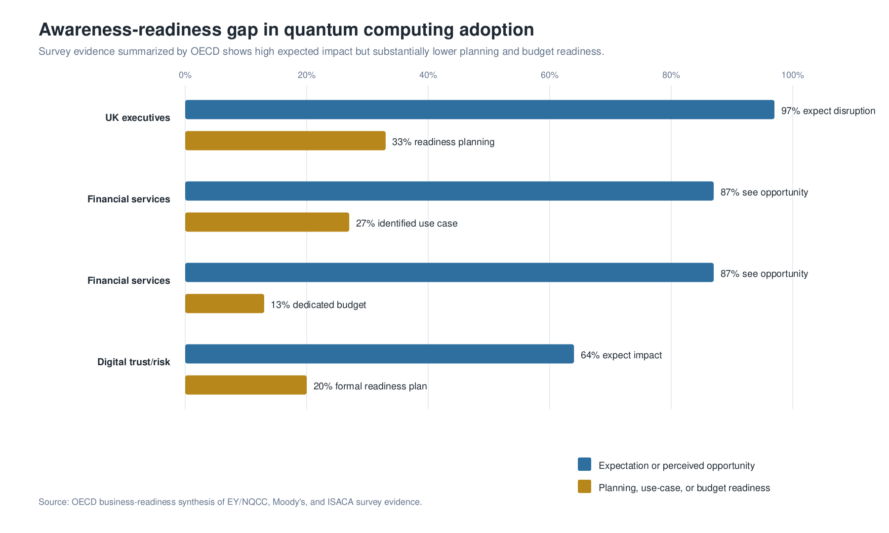
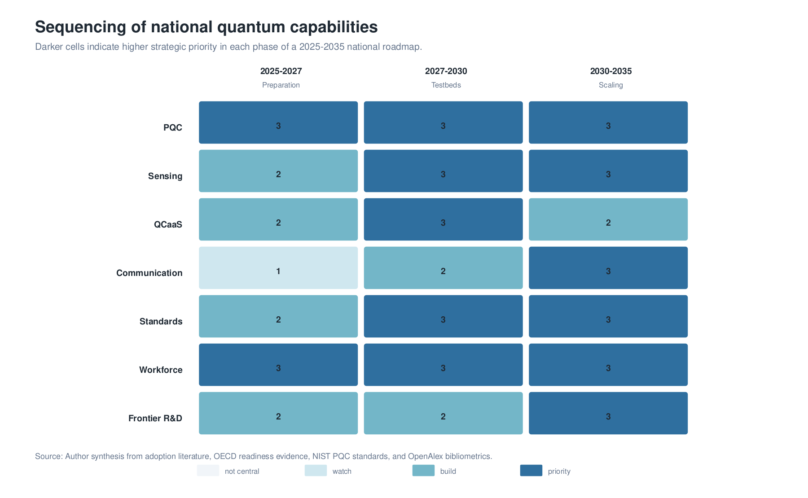
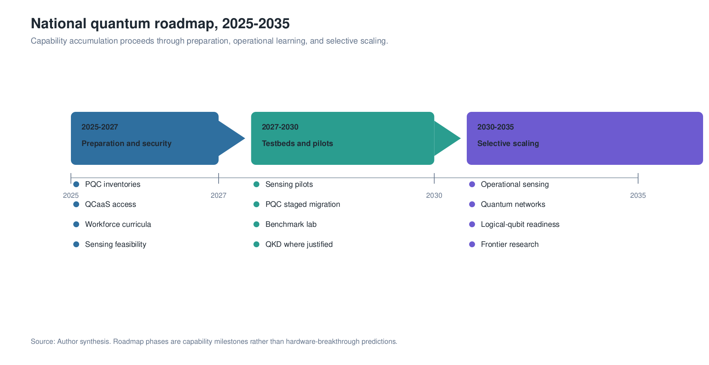

## Abstract

Quantum technologies have become a strategic domain of national innovation policy because they affect computation, measurement, cybersecurity, communications, defence, materials science, and scientific instrumentation. A national roadmap for the 2025-2035 horizon is developed from enterprise-adoption research, national innovation systems theory, OECD policy data, NIST/NSA/CISA cybersecurity guidance, OECD-EPO patent mapping, OpenAlex bibliometrics, and high-performance computing (HPC) integration studies. The evidence indicates that national quantum readiness is constrained not only by hardware maturity but also by institutional capacity, technical workforce formation, validated use cases, public procurement discipline, cryptographic migration, HPC-QC workflow capability, and standards participation. The proposed roadmap distinguishes near-term adoption imperatives, especially post-quantum cryptography and quantum sensing pilots, from medium-term testbed and supply-chain development and long-term frontier research in logical qubits, quantum repeaters, metrology, device-independent security, and foundations. National quantum strategies are more coherently evaluated through the accumulation of absorptive capacity than through symbolic hardware acquisition: the ability to understand, test, procure, secure, regulate, and eventually produce quantum technologies.

**Keywords:** national quantum strategy, quantum technologies, post-quantum cryptography, quantum sensing, quantum computing, high-performance computing, HPC-QC integration, innovation policy, public procurement, strategic infrastructure

## 1. Introduction

Quantum technologies now occupy a position similar to earlier strategic technologies such as semiconductors, aerospace, telecommunications, and artificial intelligence. They are not only scientific instruments or commercial products; they are enabling systems that may reshape security, measurement, computation, and industrial research. For that reason, the design of national quantum strategy cannot be reduced to research funding or startup promotion. It requires an integrated view of scientific capacity, industrialization, cybersecurity, standards, procurement, workforce, and international positioning.

The roadmap addresses the 2025-2035 horizon. The analysis is motivated by a central policy problem: the countries most likely to benefit from quantum technologies will not necessarily be those that announce the largest hardware ambitions, but those that build absorptive capacity before markets mature. Absorptive capacity refers here to the institutional ability to evaluate quantum claims, identify use cases, train personnel, migrate cryptographic systems, deploy early sensing applications, participate in supply chains, and maintain frontier research links.

Four research questions structure the analysis. First, what does the current evidence reveal about quantum readiness at the organizational and national levels? Second, which quantum domains are most appropriate for near-term, medium-term, and long-term policy intervention? Third, what institutional architecture can support a national quantum transition without overcommitting to immature hardware pathways? Fourth, how should high-performance computing systems mediate early quantum computing adoption?

## 2. Evidence Base and Method

The study uses a research synthesis design. Its theoretical frame draws on absorptive capacity, national innovation systems, innovation diffusion, and mission-oriented policy [@cohen1990; @lundvall1992; @nelson1993; @rogers2003; @mazzucato2018]. This frame treats quantum readiness as an institutional capability rather than as a linear consequence of scientific progress. The synthesis also treats quantum computing as part of an HPC-QC continuum rather than as an isolated successor to classical supercomputing. The adoption layer is anchored in @kwon2026, which analyzes enterprise intention to adopt quantum computing through expert interviews and a survey of 250 IT decision-makers. The policy layer relies on OECD reports on national quantum strategies and business readiness. OECD reports approximately USD 55.7 billion in announced public quantum commitments worldwide since 2013 and USD 11.235 billion PPP in 12,209 quantum-related R&D awards between 2015 and 2023 across 19 OECD members and EU-EC programmes [@oecd2025a; @oecd2026]. The security layer uses NIST, NSA, and CISA guidance, especially the 2024 NIST post-quantum cryptography standards and critical-infrastructure migration guidance [@cisaNistNsa2022; @nist2024; @nsa2024].

OpenAlex bibliometric data serve as a proxy for scientific absorptive capacity.[^proxy-limits] The query for the concept "Quantum technology" from 2015 to 2025 returns 15,279 works in the extracted concept set. The leading country affiliations in the extract are the United States, China, Germany, the United Kingdom, and France. Bibliometric data are not treated as direct adoption metrics; they approximate the distribution of research capacity that can support future adoption.

[^proxy-limits]: Adoption proxies are used because comprehensive public data on direct quantum deployment remain unavailable. Funding, publications, patents, readiness surveys, and standards activity measure different dimensions of capability and should not be interpreted as interchangeable indicators.

{width=95%}

## 3. Results: The Structure of the Readiness Gap

The international evidence shows a consistent disjunction between expected quantum impact and institutional preparation. @kwon2026 find that adoption intention increases with perceived quantum advantage, belief in quantum superiority, budget continuity, regulatory support, and co-creation capacity, while resistance and financial risk reduce adoption intent. OECD readiness data show a similar pattern across sectors: executives expect quantum technologies to matter, but many organizations lack readiness plans, dedicated budgets, and validated use cases.

| Evidence source | Quantitative evidence | Interpretation |
| --- | --- | --- |
| @kwon2026 | 250 IT decision-makers and 11 expert interviews | Adoption depends on perceived advantage, budget continuity, regulatory support, and co-creation |
| OECD national strategies | USD 55.7 billion in announced public commitments since 2013 | Quantum technologies have become a state-level strategic competition |
| OECD Fundstat | USD 11.235 billion PPP in 12,209 R&D awards, 2015-2023 | Public research investment is increasingly coordinated |
| OECD readiness surveys | High expected disruption but limited strategic planning and budgets | Awareness does not automatically produce readiness |
| OECD-EPO mapping | 31,700 mapped quantum patent families, 2005-2024 | Technological invention is measurable and geographically concentrated |
| OpenAlex | 15,279 quantum-technology works, 2015-2025 query | Scientific absorptive capacity is unevenly distributed |
| NIST PQC standards | ML-KEM, ML-DSA, and SLH-DSA finalized in 2024 | PQC migration is already an implementation agenda |

The readiness gap has three dimensions. The first is organizational: firms and agencies lack internal quantum literacy, budgets, and use-case development processes. The second is infrastructural: testbeds, standards laboratories, cryptographic inventories, and procurement rules are underdeveloped. The third is strategic: countries face choices about which capabilities to build domestically, which to access through alliances or cloud platforms, and which to monitor as frontier science.

{width=95%}

## 4. A National Capability Model

The evidence supports a five-pillar capability model.

**Scientific frontier.** National strategy requires sustained research in quantum information science, materials, photonics, metrology, algorithms, error correction, and foundations. This pillar creates long-term autonomy and supports participation in international research networks.

**Industrialization.** Industrial policy depends on realistic positions in the quantum value chain: quantum software, control systems, sensing integration, photonics, component testing, calibration, cryogenic services, cybersecurity, and metrology.

**Security and sovereignty.** The immediate policy priority is post-quantum cryptography migration. Quantum key distribution may be appropriate for selected high-value links, but it is evaluated here as specialized infrastructure rather than as a general substitute for PQC.

**Workforce.** The workforce problem extends beyond PhD-level physics. It includes technicians, engineers, cybersecurity professionals, procurement officers, and executives capable of operating, evaluating, and governing quantum systems [@kaur2022].

**Governance and standards.** Standards, benchmarks, and public procurement rules are necessary to prevent quantum washing and to align public expenditure with measurable technological performance.

{width=95%}

## 5. Roadmap 2025-2035

The roadmap is organized as a sequence of national capabilities rather than a linear prediction of hardware breakthroughs.

| Period | Strategic emphasis | Institutional actions | Expected capability |
| --- | --- | --- | --- |
| 2025-2027 | Preparation and security | Cryptographic inventories, PQC pilots, quantum readiness office, QCaaS and HPC-QC access, workforce curricula, sensing feasibility studies | Baseline institutional awareness and early security migration |
| 2027-2030 | Testbeds and early deployment | Sensing pilots, standards laboratory, procurement protocols, QKD pilots where justified, supplier mapping, applied research consortia, HPC-QC workflow pilots | Operational learning and validated early applications |
| 2030-2035 | Selective scaling and frontier integration | Logical-qubit readiness, quantum network experiments, advanced metrology, supply-chain specialization, frontier research centres, HPC-QC scaling | Domestic absorptive capacity connected to global frontier |

The sequence reflects the maturity differences among quantum domains. PQC and sensing can be pursued before fault-tolerant quantum computing. QCaaS can support learning before domestic hardware exists. Quantum communication testbeds can be developed before national-scale networks. Frontier research can proceed in parallel as a long-term option generator.

{width=95%}

## 6. Institutional Architecture

The roadmap requires institutional coordination. A National Quantum Office coordinates policy, funding, international partnerships, and performance monitoring. A Post-Quantum Cryptography Task Force manages cryptographic inventories, prioritization, and migration schedules. A National Quantum Testbed Network connects universities, agencies, firms, and infrastructure operators. A Quantum Standards and Benchmarking Laboratory evaluates claims, interoperability, security, and procurement metrics. A Quantum Workforce Council aligns educational programmes with expected demand. A Frontier Quantum Research Fund supports high-risk work in error correction, metrology, repeaters, foundations, and measurement science.

The purpose of this architecture is not bureaucratic expansion. It is coordination under uncertainty. Quantum technologies are difficult to evaluate because performance claims are highly technical, market forecasts are volatile, and hardware trajectories remain contested. Public institutions therefore need evaluation capacity before procurement scales.

## 7. Strategic Domains

Post-quantum cryptography is the first national adoption domain because it addresses long-lived security risk and is already supported by standards. The transition requires asset inventories, crypto-agility, staged migration, vendor coordination, and critical-infrastructure governance.

Quantum sensing is the strongest near-term public-value domain. Sensing applications can target geodesy, infrastructure monitoring, underground water, navigation, health, mining, energy systems, and environmental risk. These pilots can generate measurable value and build engineering capacity.

Quantum computing initially functions as a learning and benchmarking domain. QCaaS access allows universities, agencies, and firms to test algorithms without owning immature hardware. The relevant output is not immediate advantage but organizational competence.

High-performance computing is the transition layer for quantum computing. In this model, quantum processing units operate as potential accelerators embedded in HPC workflows, while classical systems handle data preparation, scheduling, error mitigation, verification, and post-processing [@cranganore2024; @beck2024; @liu2024]. HPC centers therefore become early quantum adoption institutions even before domestic quantum hardware exists. Their role is to connect quantum software experiments to scientific codes, data infrastructure, reproducible workflows, and classical baselines.

Quantum communication is best developed through targeted testbeds. Repeater technologies, memories, entanglement distribution, and device-independent security are important frontier areas, while wide deployment depends on operational evidence and cost-benefit analysis.

## 8. Discussion

The roadmap implies that national quantum strategy is more coherently evaluated by capability accumulation than by headline hardware acquisition. This distinction is important because premature hardware procurement can create dependency, while readiness programmes create optionality. Countries that develop cryptographic migration capacity, sensing testbeds, HPC-QC workflow capacity, workforce pathways, and standards laboratories will be better positioned to adopt quantum technologies regardless of which hardware modality prevails.

The roadmap also rejects a false choice between near-term applications and foundational science. Near-term applications generate institutional learning and public value. Frontier research generates long-term scientific autonomy, instrumentation, and human capital. A robust strategy requires both layers.

## 9. Acknowledgments

This manuscript was prepared for the Quantum Technologies track of the twenty-third edition of the Global Information Technology Management Association Annual Conference, Monterrey, Mexico, May 6-8, 2026. The author acknowledges his role as Track Chair for Quantum Technologies and gratefully acknowledges Rogelio Marín and the Centro de Investigación en Matemáticas, A.C. for intellectual support and institutional context. All interpretations and remaining errors are the author's responsibility.

## 10. Data Availability

The quantitative evidence underlying this roadmap is drawn from OECD public reports, NIST/NSA/CISA guidance, OECD-EPO patent mapping, and OpenAlex bibliometric queries. Processed OpenAlex CSV extracts used for country and year counts are deposited in the companion research repository.

## 11. Code Availability

The companion research repository is available at https://github.com/ekaropolus/quantum-technologies-national-strategy. It contains the source manuscript, processed data, BibTeX bibliography, figure-generation code, and reproducible build script used to generate the manuscript outputs. The repository is intended to support inspection of the OpenAlex extracts, regeneration of figures, and reconstruction of the PDF, TeX, and DOCX versions from the manuscript sources.

## 12. Limitations

The analysis relies on adoption proxies rather than direct deployment data. Funding, publications, patents, standards, and readiness surveys measure different dimensions of quantum capacity and are not interchangeable. A future empirical extension would require national surveys of firms, agencies, and infrastructure operators.

## 13. Competing Interests

The author declares no competing interests.

## References

::: {#refs}
:::
