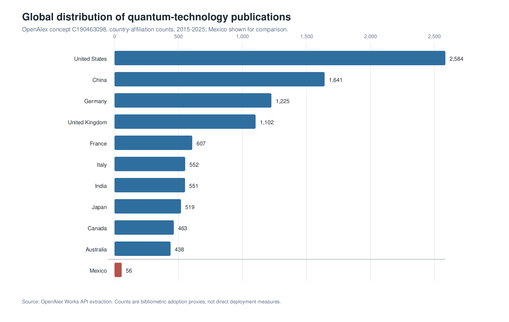
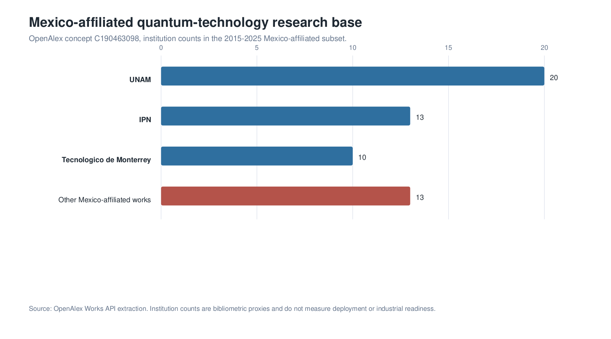
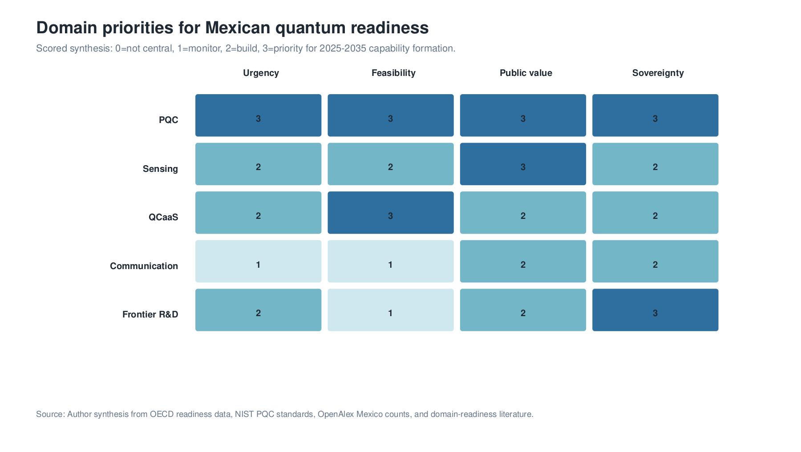

## Abstract

Quantum technologies are examined as an emerging layer of Mexican digital transformation. Rather than treating quantum computing as a distant replacement for existing digital policy, the analysis situates quantum technologies within a strategic infrastructure agenda that intersects with cybersecurity, measurement, cloud access, high-performance computing, artificial intelligence, industrial modernization, and scientific sovereignty. The evidentiary base includes enterprise-adoption research, OECD data on business readiness and national quantum strategies, NIST/NSA/CISA cybersecurity guidance, OpenAlex bibliometric indicators, and recent studies on hybrid HPC-QC workflows. The evidence indicates that quantum adoption is constrained less by awareness than by organizational readiness, technical talent, validated use cases, standards, procurement discipline, and absorptive capacity. Mexico's relevant near-term problem is therefore not immediate ownership of universal fault-tolerant quantum hardware, but the construction of capabilities in post-quantum cryptography, quantum sensing, HPC-QC workflow experimentation, quantum software, metrology, standards, and frontier research. OpenAlex data identify a small but measurable Mexican research base in quantum technology, led in the extracted dataset by UNAM, IPN, and Tecnologico de Monterrey. Mexico's quantum transition is consequently framed as a sequenced national capability problem: cryptographic migration and sensing pilots first, cloud-mediated and HPC-mediated experimentation and workforce formation second, and selective frontier research and international integration as the long-term platform for technological autonomy.

**Keywords:** Mexico, digital transformation, quantum technologies, post-quantum cryptography, quantum sensing, quantum computing, high-performance computing, HPC-QC integration, innovation policy, technological sovereignty

## 1. Introduction

The literature and policy discourse on Mexican digital transformation have generally emphasized artificial intelligence, machine learning, cloud infrastructure, distributed ledgers, open data, automation, and digital government. These technologies remain central to the modernization of public administration, finance, health, logistics, manufacturing, and urban services. They do not, however, exhaust the technological horizon of the coming decade. Quantum technologies introduce a different layer of digital transformation: one concerned not only with data processing, but also with the physical limits of computation, measurement, security, synchronization, simulation, and communication.

The analysis examines how quantum technologies can be framed within the Mexican digital transformation agenda. It does not assume that Mexico will reproduce the quantum strategies of the United States, China, the European Union, or the United Kingdom. Rather, it asks how a middle-income, manufacturing-intensive, digitally uneven, scientifically capable country can participate in the quantum transition through selective capability building. The central proposition is that Mexico's first-order quantum policy problem is not hardware sovereignty in universal quantum computing, but readiness: the ability to understand, procure, regulate, test, and integrate quantum technologies as they become relevant to national problems.

Four research questions structure the article. First, what does the international evidence on quantum adoption suggest about organizational and national readiness? Second, what quantitative indicators can be used to approximate Mexico's current absorptive capacity in quantum technologies? Third, which domains of quantum technology are most relevant to Mexican digital transformation in the 2025-2035 horizon? Fourth, how can Mexican HPC infrastructure mediate the transition from classical scientific computing to quantum computing?

## 2. Literature and Policy Background

Quantum technologies are commonly organized into four domains: quantum computing, quantum sensing, quantum communication, and post-quantum cryptography. These domains differ in technological maturity, infrastructure requirements, commercial pathways, and relevance to national policy. Quantum computing remains the most visible domain, but its broad economic impact depends on fault-tolerant architectures, logical qubits, algorithms, and cloud-mediated experimentation [@preskill2018; @bova2020]. Quantum sensing is closer to deployment in selected applications because it uses quantum effects to improve measurement rather than to perform universal computation. Quantum communication provides specialized security primitives and long-term network possibilities, but it faces cost, distance, and device-assurance challenges. Post-quantum cryptography is a software and standards transition that can be pursued before cryptographically relevant quantum computers exist.

The quantum computing pathway is also an HPC pathway. Recent studies on hybrid quantum-classical workflows frame quantum processing units as accelerators embedded in scientific computing environments rather than as stand-alone replacements for supercomputers [@cranganore2024; @beck2024; @liu2024]. For Mexico, QCaaS and domestic HPC capacity are complementary: cloud-based QPUs can support experimentation, while HPC centers provide simulation, benchmarking, data preparation, workflow integration, error-mitigation loops, and validation against classical baselines.

The adoption literature indicates that quantum readiness is not a simple function of technological availability. @kwon2026 analyze enterprise intention to adopt quantum computing through a sequential explanatory design based on expert interviews and a survey of 250 IT decision-makers. They find that adoption intention is shaped by perceived quantum advantage, belief in quantum superiority, budget continuity, regulatory support, organizational resistance, financial risk, and co-creation. This evidence is important for Mexico because it suggests that adoption depends on institutional conditions and absorptive capacity, not only on hardware maturity.

The theoretical framing follows the literature on absorptive capacity and national innovation systems. Absorptive capacity describes the ability to recognize, assimilate, and use external knowledge [@cohen1990]. National innovation systems locate technological performance in networks of firms, universities, public agencies, standards bodies, and financial institutions rather than in isolated inventions [@lundvall1992; @nelson1993]. This matters for quantum policy because scientific capability alone does not create adoption. Adoption requires complementary assets: standards, procurement competence, cybersecurity governance, technical education, cloud access, laboratories, and sectoral demand.

OECD readiness data reinforce this conclusion. The surveys summarized by OECD show that executives often expect quantum impact but lack readiness plans, dedicated budgets, and validated use cases [@oecd2026]. This gap is especially relevant to countries where digital transformation has historically advanced unevenly across sectors and regions. If quantum technologies are introduced without procurement standards, technical workforce development, and sectoral pilots, they are likely to appear either as imported infrastructure or as symbolic innovation discourse rather than as operational capability.

## 3. Data and Methods

The study uses a research synthesis design organized around five evidence layers. The first layer is the adoption literature, with @kwon2026 used as the principal empirical anchor for organizational adoption. The second layer consists of OECD reports on quantum readiness, national strategies, and public commitments [@oecd2025a; @oecd2026]. The third layer uses official cybersecurity and standards documents from NIST, NSA, and CISA to assess the urgency of post-quantum cryptography migration [@cisaNistNsa2022; @nist2024; @nsa2024]. The fourth layer uses OpenAlex bibliometric data as a proxy for research capacity.[^bibliometric-proxy] The fifth layer uses HPC-QC studies to evaluate quantum computing as a heterogeneous scientific-computing transition rather than as a discrete hardware substitution.

[^bibliometric-proxy]: Bibliometric indicators are used as reproducible proxies for scientific absorptive capacity. They do not measure deployment, commercialization, or sectoral adoption.

The OpenAlex extraction queried the concept "Quantum technology" for works published from 2015 to 2025 and grouped results by institutional country. This method does not measure adoption directly. It measures one dimension of absorptive capacity: the presence of researchers and institutions participating in the scientific literature. The Mexico subset is interpreted cautiously because bibliometric counts are sensitive to concept assignment, co-authorship patterns, institutional metadata, and publication-year indexing. Nevertheless, such counts provide a reproducible baseline for comparing Mexico's research presence with leading quantum economies.

{width=95%}

## 4. Results

### 4.1 The International Readiness Gap

The international evidence indicates a substantial gap between expected quantum impact and organizational preparation. OECD summarizes executive surveys in which high shares of respondents expect quantum technologies to affect their sectors, while far smaller shares report strategic planning, budgets, or identified commercial use cases. In one UK executive survey summarized by OECD, 97% of respondents expected disruption, yet only about one-third had begun strategic readiness planning. In a financial-sector survey, 87% saw quantum computing as an opportunity, while 73% lacked an identified application with real commercial advantage and 87% had no dedicated quantum budget. ISACA's 2025 survey reports that only 20% of respondents had formal quantum readiness plans despite broad expectations of future impact [@oecd2026].

For Mexico, the implication is that awareness-building is not sufficient. Institutional readiness depends on cryptographic inventories, procurement criteria, technical workforce programmes, pilot funding, access to testing infrastructure, and mechanisms for comparing quantum solutions against classical baselines.

{width=95%}

### 4.2 Mexico's Research Absorptive Capacity

OpenAlex bibliometric data indicate that Mexico has a small but identifiable research base in quantum technology. In the 2015-2025 query for the "Quantum technology" concept, Mexico appears with 56 works. This is modest compared with the United States (2,584), China (1,641), Germany (1,225), the United Kingdom (1,102), and France (607). Within the Mexico-affiliated subset, the leading institutions are Universidad Nacional Autonoma de Mexico (20 works), Instituto Politecnico Nacional (13), and Tecnologico de Monterrey (10). These counts are not a ranking of technological readiness, but they indicate that Mexico is not starting from zero. A national programme could use this base to organize training, testbeds, applied research, and international collaboration.

{width=92%}

### 4.3 Domain Priorities for Mexican Digital Transformation

Four domains emerge as policy-relevant. First, post-quantum cryptography is the clearest near-term priority because it addresses long-lived cybersecurity risk and can be implemented through standards, software, and protocol migration. Second, quantum sensing is the strongest early application domain for Mexican public problems, including groundwater, infrastructure monitoring, geodesy, health, mining, energy systems, and environmental risk. Third, quantum computing is most credible in the near term as cloud-based and HPC-mediated experimentation, benchmarking, workflow integration, and workforce development rather than immediate domestic hardware acquisition. Fourth, quantum communication is a specialized strategic infrastructure domain, suitable for research, telecom experimentation, and high-value security pilots rather than broad substitution for existing cybersecurity.

{width=95%}

## 5. Discussion

The findings frame Mexico's quantum transition as a problem of capability sequencing. The first stage is institutional preparation: PQC migration planning, training, standards, and access to QCaaS and HPC-QC platforms. The second stage is applied experimentation: sectoral sensing pilots, quantum software testbeds, hybrid workflow pilots, and procurement methods that require comparison with classical alternatives. The third stage is strategic integration: participation in supply chains, international research partnerships, and frontier research that can produce long-term scientific autonomy.

HPC is central to this sequence because it gives quantum computing an operational institutional home. Mexican universities, laboratories, and public agencies do not need to wait for domestic ownership of fault-tolerant quantum computers before building quantum capability. They can begin by connecting quantum programming, quantum simulation, and QCaaS access to existing scientific-computing environments. This approach also disciplines adoption claims: quantum subroutines are evaluated inside complete workflows, with queue latency, data movement, error mitigation, classical optimization, and verification included in the performance assessment.

This sequencing also changes how quantum technologies relate to artificial intelligence, machine learning, and blockchain. Quantum technologies are not replacements for these digital agendas; they alter the infrastructure beneath them. AI can support quantum calibration, sensor interpretation, and materials discovery. Distributed ledgers and public records require post-quantum security if they are to preserve long-lived trust. Cloud platforms become the initial channel through which most Mexican institutions will access quantum processors. Cybersecurity links the entire agenda because current public-key cryptography will be affected by future quantum capability.

## 6. Policy Implications

The analysis supports six policy implications. First, PQC migration is best treated as a digital-infrastructure programme rather than as a narrow cybersecurity procurement. Second, quantum sensing has the strongest public-value fit when linked to concrete missions in water, energy, health, civil protection, infrastructure, and environmental monitoring. Third, a national QCaaS, HPC-QC, and quantum software testbed would build human capital without premature hardware lock-in. Fourth, procurement requires benchmarks, classical baselines, interoperability, and total-cost analysis. Fifth, universities and research centres can be connected through a national quantum workforce, metrology, and scientific-computing network. Sixth, frontier research funding is most strategic when it generates instrumentation capacity and international scientific relevance.

## 7. Conclusion

Quantum technologies are relevant to Mexican digital transformation because they affect the security, measurement, and computational layers on which digital society depends. The evidence does not support a passive wait-and-see posture. It also does not support symbolic investment in immature hardware without institutional capacity. The most defensible strategy is a sequenced one: PQC, sensing, workforce, standards, and cloud-based plus HPC-mediated experimentation in the first phase; applied testbeds in the second; and frontier research plus international collaboration as the long-term basis for scientific autonomy.

## Acknowledgments

This manuscript was prepared for the Quantum Technologies track of the twenty-third edition of the Global Information Technology Management Association Annual Conference, Monterrey, Mexico, May 6-8, 2026. The author acknowledges his role as Track Chair for Quantum Technologies and gratefully acknowledges Rogelio Marín and the Centro de Investigación en Matemáticas, A.C. for intellectual support and institutional context. All interpretations and remaining errors are the author's responsibility.

## Data Availability

The quantitative evidence underlying the analysis comes from OECD public reports, NIST/NSA/CISA guidance, and OpenAlex bibliometric queries. Processed OpenAlex CSV extracts for country and year counts are deposited in the companion research repository.

## Code Availability

The companion research repository is available at https://github.com/ekaropolus/quantum-technologies-national-strategy. It contains the source manuscript, processed data, BibTeX bibliography, figure-generation code, and reproducible build script used to generate the manuscript outputs. The repository is intended to support inspection of the OpenAlex extracts, regeneration of figures, and reconstruction of the PDF, TeX, and DOCX versions from the manuscript sources.

## Limitations

The Mexico-specific analysis uses global adoption evidence and bibliometric proxies rather than a dedicated national survey of Mexican firms and agencies. A future empirical extension would require Mexican stakeholder interviews, sector surveys, and cryptographic asset inventory data.

## Competing Interests

The author declares no competing interests.

## References

::: {#refs}
:::
